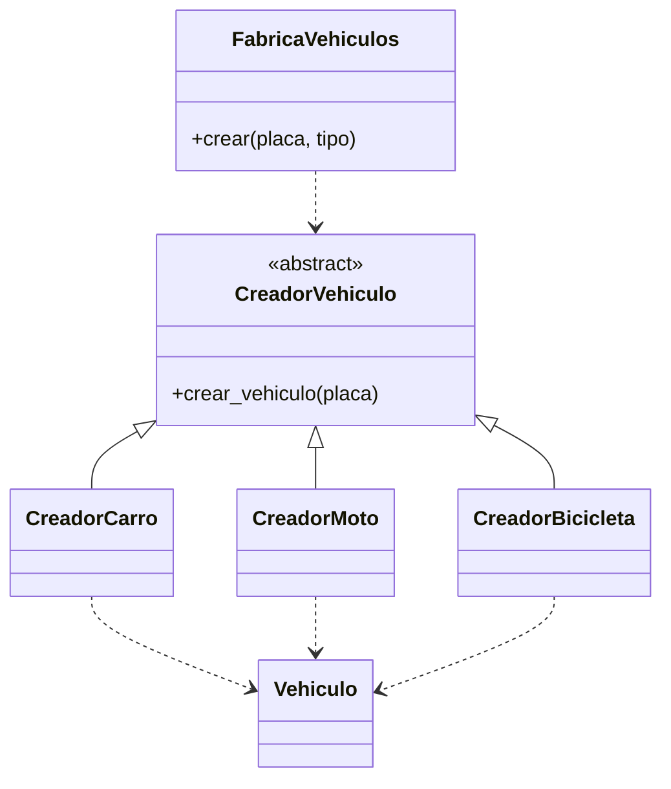

# Diagrama Factory Method

```mermaid
classDiagram
    class CreadorVehiculo {
        <<abstract>>
        +crear_vehiculo(placa)
    }

    class CreadorCarro
    class CreadorMoto
    class CreadorBicicleta

    class FabricaVehiculos {
        +crear(placa, tipo)
    }

    class Vehiculo

    CreadorVehiculo <|-- CreadorCarro
    CreadorVehiculo <|-- CreadorMoto
    CreadorVehiculo <|-- CreadorBicicleta

    FabricaVehiculos ..> CreadorVehiculo
    CreadorCarro ..> Vehiculo
    CreadorMoto ..> Vehiculo
    CreadorBicicleta ..> Vehiculo
```
