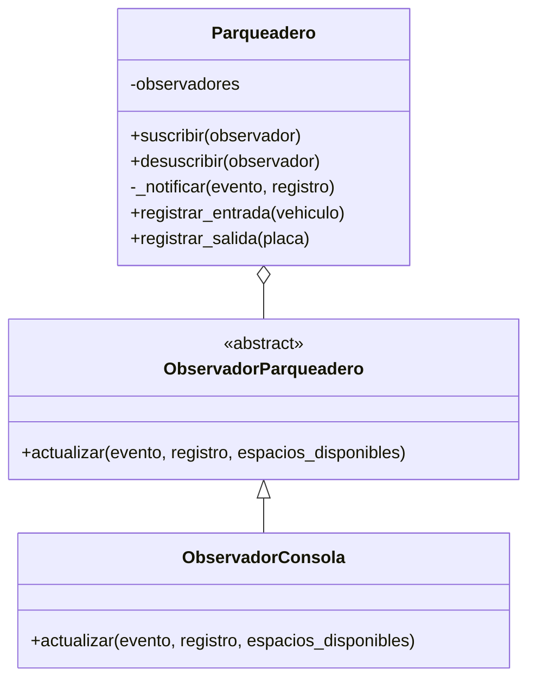

# Diagrama Observer

```mermaid
classDiagram
    class Parqueadero {
        -observadores
        +suscribir(observador)
        +desuscribir(observador)
        -_notificar(evento, registro)
        +registrar_entrada(vehiculo)
        +registrar_salida(placa)
    }

    class ObservadorParqueadero {
        <<abstract>>
        +actualizar(evento, registro, espacios_disponibles)
    }

    class ObservadorConsola {
        +actualizar(evento, registro, espacios_disponibles)
    }

    Parqueadero o-- ObservadorParqueadero
    ObservadorParqueadero <|-- ObservadorConsola
```
