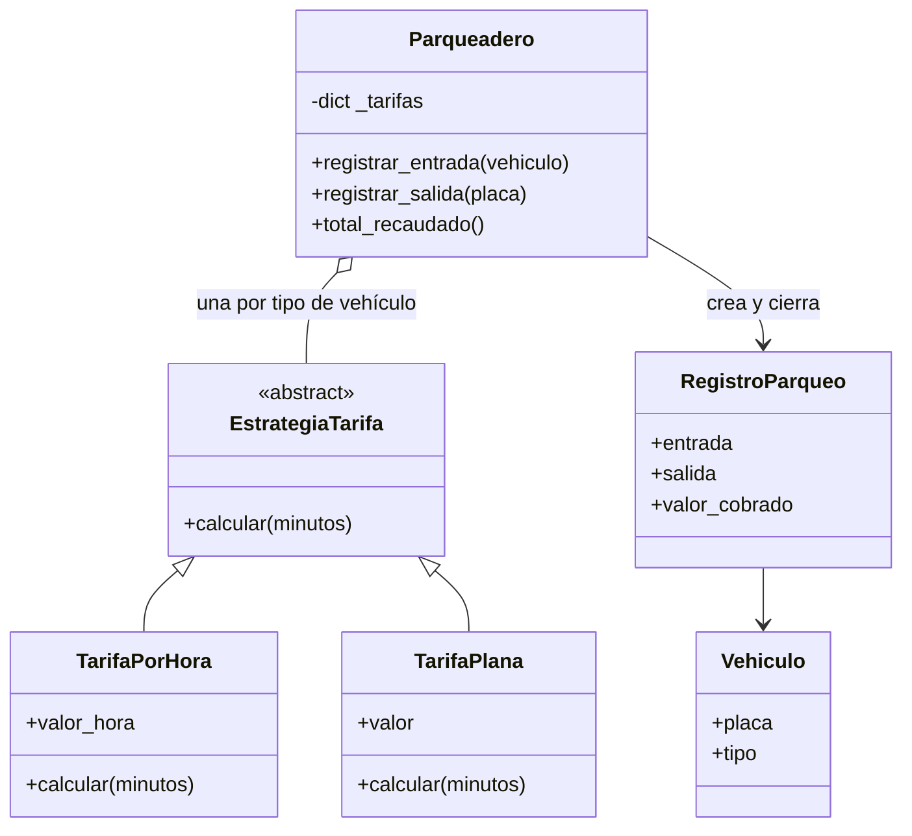
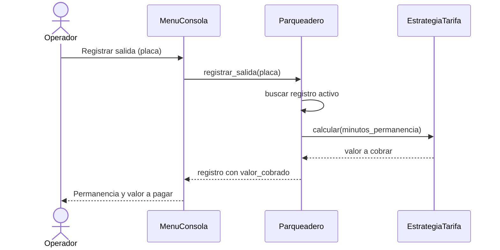

# Diagramas del patrón Strategy

Los diagramas están escritos en Mermaid, que GitHub renderiza directamente.

## Diagrama de clases

```mermaid
classDiagram
    class Parqueadero {
        -dict _tarifas
        +registrar_entrada(vehiculo)
        +registrar_salida(placa)
        +total_recaudado()
    }
    class EstrategiaTarifa {
        <<abstract>>
        +calcular(minutos)
    }
    class TarifaPorHora {
        +valor_hora
        +calcular(minutos)
    }
    class TarifaPlana {
        +valor
        +calcular(minutos)
    }
    class Vehiculo {
        +placa
        +tipo
    }
    class RegistroParqueo {
        +entrada
        +salida
        +valor_cobrado
    }

    Parqueadero o-- EstrategiaTarifa : una por tipo de vehículo
    EstrategiaTarifa <|-- TarifaPorHora
    EstrategiaTarifa <|-- TarifaPlana
    Parqueadero --> RegistroParqueo : crea y cierra
    RegistroParqueo --> Vehiculo
```

## Diagrama de secuencia: salida de un vehículo

```mermaid
sequenceDiagram
    actor Operador
    participant Menu as MenuConsola
    participant P as Parqueadero
    participant E as EstrategiaTarifa

    Operador->>Menu: Registrar salida (placa)
    Menu->>P: registrar_salida(placa)
    P->>P: buscar registro activo
    P->>E: calcular(minutos_permanencia)
    E-->>P: valor a cobrar
    P-->>Menu: registro con valor_cobrado
    Menu-->>Operador: Permanencia y valor a pagar
```